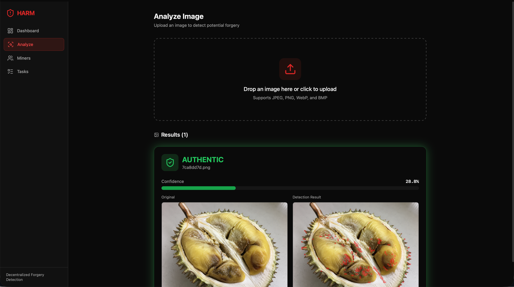

# HARM — Hey Asshole, Return Money

<p align="center">
  
</p>

Decentralized image forgery detection for e-commerce refund fraud. A Bittensor subnet proposal.



## Quick Start

```bash
# 1. Install dependencies
pip install -r backend/requirements.txt
pip install -e ".[dev]"

# 2. Start backend (port 8000)
PYTHONPATH=. uvicorn backend.main:app --reload --port 8000

# 3. Start frontend (port 5173)
cd frontend && npm install && npm run dev
```

Open http://localhost:5173

## Usage

- **Dashboard** — Network stats, recent analyses, miner leaderboard
- **Analyze** — Upload a suspicious image, get verdict (authentic/tampered) + confidence + detection overlay
- **Submit** — Simulate the full Miner Commit-Reveal workflow: accept task → analyze → compute SHA-256 hash → commit → reveal → get scored
- **Miners** — View registered miners, probe accuracy, strike status
- **Tasks** — Browse probe and real tasks, generate new probes

## Architecture

```
src/                — Core subnet logic
├── protocol.py         Data types (Verdict, ForgeryMethod, MinerResponse, etc.)
├── validator/
│   ├── forge.py        Forge Engine: 4 tampering methods (copy-move, splicing, compression, noise)
│   └── scorer.py       Probe scorer, consensus voting, epoch aggregation
└── miner/
    ├── detector.py     Forgery detector (ELA + noise analysis pipeline)
    ├── model_registry.py   10 backend integrations with auto-selection
    └── backends/       ELA, ManTraNet, TruFor, CAT-Net, MVSS-Net, PSCC-Net, FOCAL, IML-ViT, Mesorch, ProFact

backend/            — FastAPI REST API
├── api/routes/         Dashboard, images, miners, tasks (incl. commit-reveal)
├── services/           Business logic (forge, detect, miner, task services)
└── db/store.py         In-memory state store

frontend/           — React + Tailwind UI
tests/              — 262 unit tests (pytest)
docs/               — Proposal document and architecture plans
```

## Testing

```bash
# Run all tests from project root
PYTHONPATH=. pytest tests/ -v
```

262 unit tests covering:
- Core logic: protocol types, forge engine, scorer, detector, ELA backend, model registry
- Backend services: store, miner service, task service, forge service, detect service
- API routes: dashboard, images, miners, tasks, commit-reveal protocol

## Key Features

- **Commit-Reveal Protocol** — SHA-256 hash commitment prevents miners from copying others' responses
- **Probe Scoring** — IoU mask accuracy + confidence calibration + method classification bonus
- **Strike System** — Sliding window (last 10 probes), yellow/red/ban thresholds
- **Method-Agnostic Mining** — Supports ML models, human analysts, and hybrid pipelines
- **Lightweight Validators** — CPU-only, no GPU required (OpenCV forge engine + arithmetic scoring)

## Scoring Formula

```
S_probe = P_correct × (0.4 × IoU + 0.4 × C_cal + 0.2 × M_bonus)
S_total = 0.60 × avg(S_probe) + 0.35 × avg(S_consensus) + 0.05 × S_latency
```

## License

MIT
